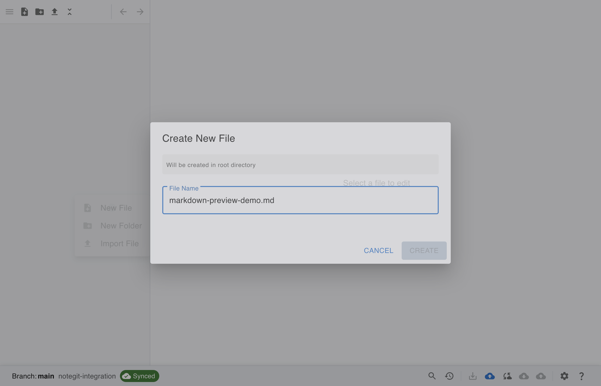
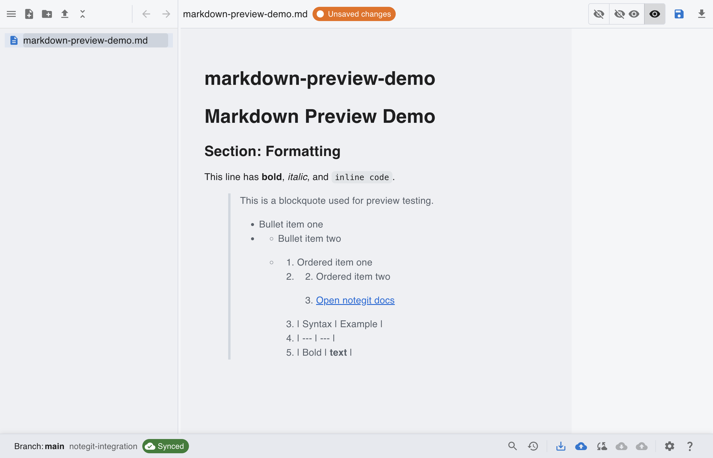
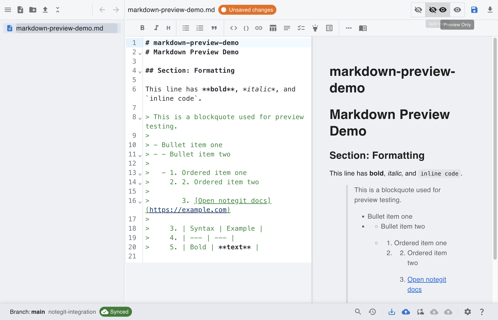

# Create a New Markdown File and Review in Preview + Split Mode

This scenario skips repository setup screenshots and starts from an already connected workspace.

## Step 1: Start from connected workspace

Repository creation/login is already completed. Begin this scenario from the connected workspace.

## Step 2: Create a new markdown file

Use the file tree context menu, choose New File, and enter your markdown file name.

## Step 3: Add markdown content with multiple tags

This file includes at least five markdown patterns: headings, bold, italic, inline code, blockquote, list types, link, and table.

## Step 4: Check rendered result in preview mode

Switch to Preview Only to inspect how the markdown is rendered without the editor pane.

## Step 5: Review source and output in split mode

Switch back to Split View to compare raw markdown and rendered preview side by side.

