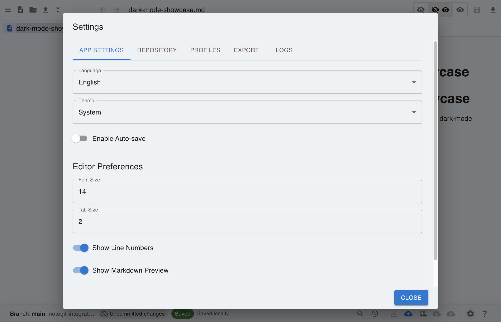
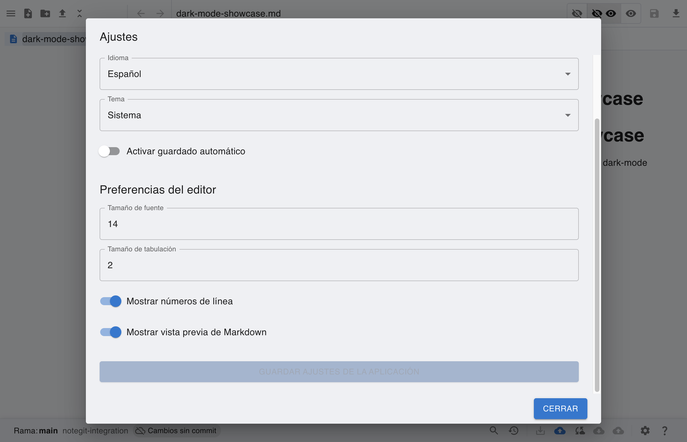
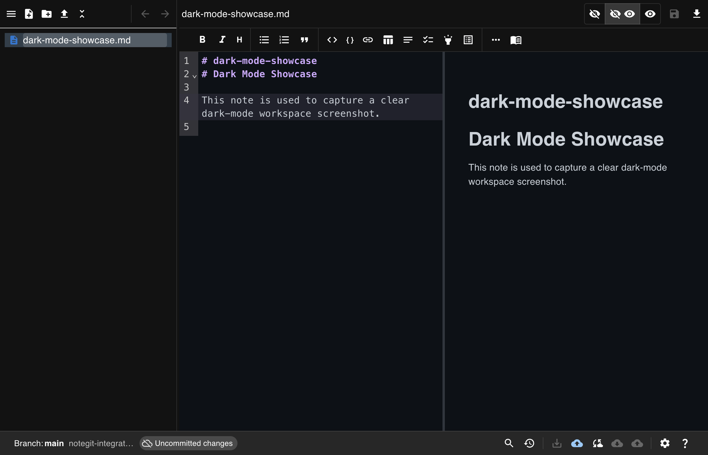
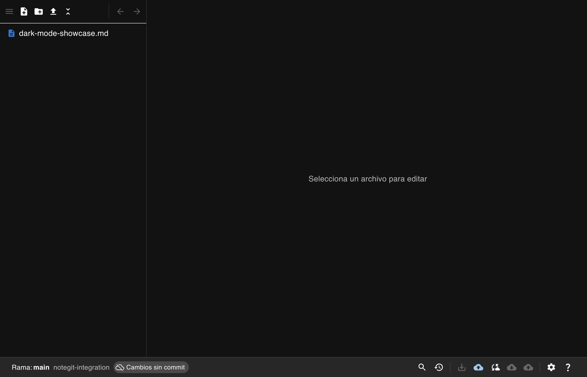

# [Global] Switch Language and Verify Persistence

This scenario shows how to switch UI language in Settings and verify the selection persists after restart.

## Step 1: Open connected workspace in default language

Start from a connected workspace before changing language preferences.

## Step 2: Open app language settings

Open Settings and App Settings tab to access the language dropdown.

## Step 3: Save language selection

Select Spanish (`es-ES`) and save app settings to apply localization.

## Step 4: Work in dark mode

Use **Dark** theme and continue working in a low-light workspace (shown here in English UI).

## Step 5: Restart and verify language persistence

After reopening the app, the previously selected language remains active.

